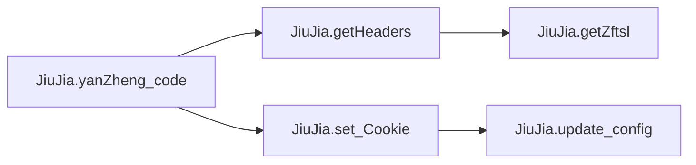
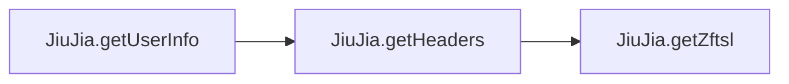
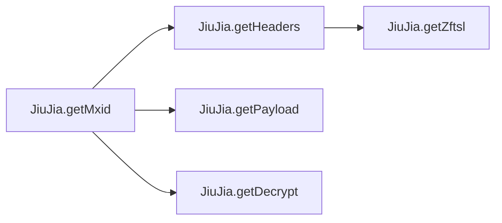
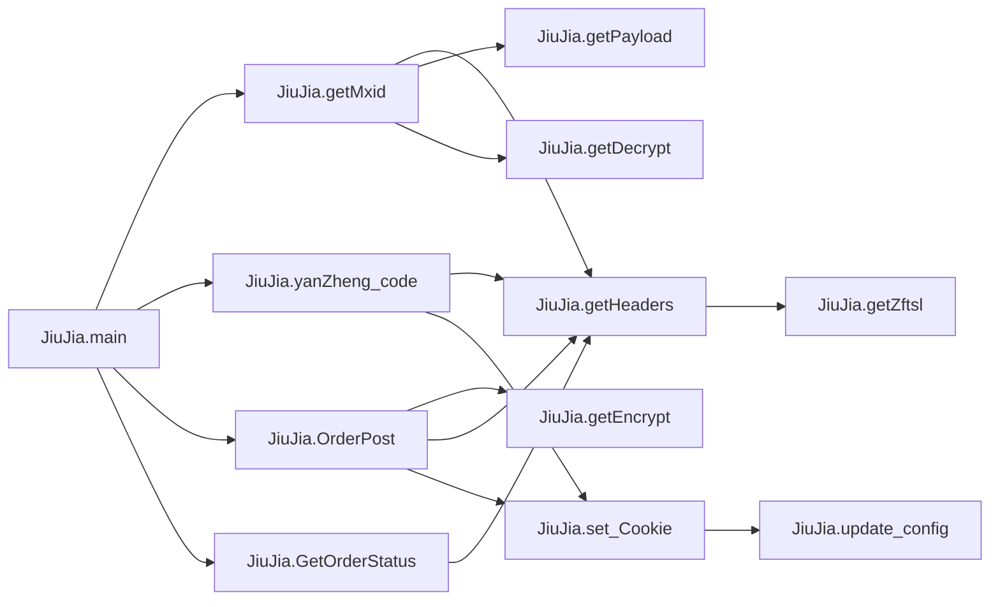
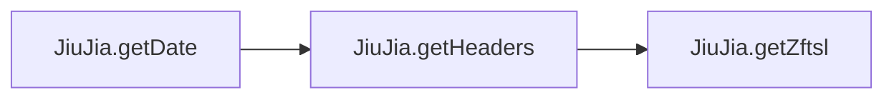
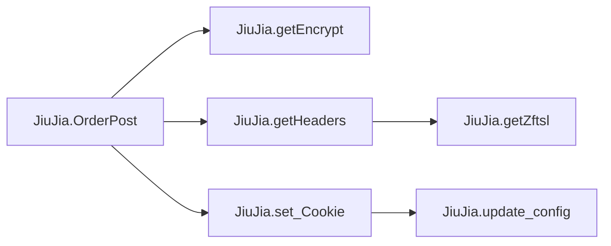
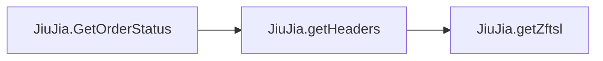
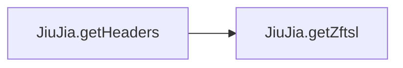
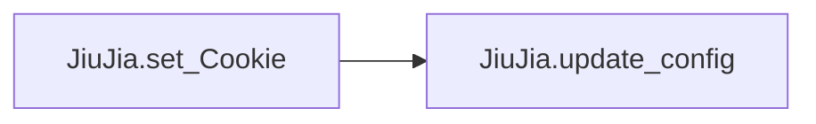

# Key Objects

[_Documentation generated by Documatic_](https://www.documatic.com)

<!---Documatic-section-JiuJia.file_config-start--->
## JiuJia.file_config

<!---Documatic-section-file_config-start--->
<!---Documatic-block-JiuJia.file_config-start--->
<details>
	<summary><code>JiuJia.file_config</code> code snippet</summary>

```python
def file_config():
    global cookie
    global wait_speed
    global buy_speed
    global p_id
    global id
    cf = configparser.RawConfigParser()
    if os.path.exists('jiujia.ini'):
        try:
            cf.read('jiujia.ini', encoding='utf-8')
            cookie = cf.get('jiujia', 'cookie')
            wait_speed = cf.get('jiujia', 'wait_speed')
            buy_speed = cf.get('jiujia', 'buy_speed')
            p_id = cf.get('jiujia', 'p_id')
            id = cf.get('jiujia', 'id')
            c = requests.cookies.RequestsCookieJar()
            c.set('ASP.NET_SessionId', cookie)
            x.cookies.update(c)
        except Exception as e:
            print('配置文件错误', e)
            input('')
            sys.exit(0)
    else:
        print('jiujia.ini配置文件不存在当前文件夹下。')
        input('')
        sys.exit(0)
```
</details>
<!---Documatic-block-JiuJia.file_config-end--->
<!---Documatic-section-file_config-end--->

# #
<!---Documatic-section-JiuJia.file_config-end--->

<!---Documatic-section-JiuJia.yanZheng_code-start--->
## JiuJia.yanZheng_code

<!---Documatic-section-yanZheng_code-start--->


### Object Calls

* JiuJia.getHeaders
* JiuJia.set_Cookie

<!---Documatic-block-JiuJia.yanZheng_code-start--->
<details>
	<summary><code>JiuJia.yanZheng_code</code> code snippet</summary>

```python
def yanZheng_code(mxid):
    global r_cookie
    payload = {'act': 'GetCaptcha', 'mxid': mxid}
    try:
        r = x.get(url=url + '/sc/wx/HandlerSubscribe.ashx', headers=getHeaders(), params=payload, verify=False, timeout=1)
        j = json.loads(r.text)
        r_cookie = r
        set_Cookie(r)
        if j['status'] == 200:
            return True
        else:
            print('状态: 有验证码：', r.text)
            return False
    except Exception as e:
        print('验证码出错：', e)
        return False
```
</details>
<!---Documatic-block-JiuJia.yanZheng_code-end--->
<!---Documatic-section-yanZheng_code-end--->

# #
<!---Documatic-section-JiuJia.yanZheng_code-end--->

<!---Documatic-section-JiuJia.getPayload-start--->
## JiuJia.getPayload

<!---Documatic-section-getPayload-start--->
<!---Documatic-block-JiuJia.getPayload-start--->
<details>
	<summary><code>JiuJia.getPayload</code> code snippet</summary>

```python
def getPayload(p_id, id, scdate):
    payload = {'act': 'GetCustSubscribeDateDetail', 'pid': p_id, 'id': id, 'scdate': scdate}
    return payload
```
</details>
<!---Documatic-block-JiuJia.getPayload-end--->
<!---Documatic-section-getPayload-end--->

# #
<!---Documatic-section-JiuJia.getPayload-end--->

<!---Documatic-section-JiuJia.getUserInfo-start--->
## JiuJia.getUserInfo

<!---Documatic-section-getUserInfo-start--->


### Object Calls

* JiuJia.getHeaders

<!---Documatic-block-JiuJia.getUserInfo-start--->
<details>
	<summary><code>JiuJia.getUserInfo</code> code snippet</summary>

```python
def getUserInfo():
    global birthday, tel, cname, sex, idcard
    payload = {'act': 'User'}
    try:
        r = x.get(url=url + '/sc/wx/HandlerSubscribe.ashx', params=payload, headers=getHeaders(), verify=False)
        j = json.loads(r.text)
        if j['status'] == 200:
            birthday = j['user']['birthday']
            tel = j['user']['tel']
            sex = j['user']['sex']
            cname = j['user']['cname']
            idcard = j['user']['idcard']
            print('登录成功，用户：', cname, end='')
            return True
        else:
            print('Cookie出错：%s' % r.text)
            input('退出程序')
            sys.exit(0)
            return False
    except Exception as e:
        print('无法正常运行', e)
        input('退出程序')
        sys.exit(0)
        return False
```
</details>
<!---Documatic-block-JiuJia.getUserInfo-end--->
<!---Documatic-section-getUserInfo-end--->

# #
<!---Documatic-section-JiuJia.getUserInfo-end--->

<!---Documatic-section-JiuJia.getZftsl-start--->
## JiuJia.getZftsl

<!---Documatic-section-getZftsl-start--->
<!---Documatic-block-JiuJia.getZftsl-start--->
<details>
	<summary><code>JiuJia.getZftsl</code> code snippet</summary>

```python
def getZftsl():
    strtime = str(round(time.time() * 100))
    str1 = 'zfsw_' + strtime
    md5.update(str1.encode('utf-8'))
    value = md5.hexdigest()
    return value
```
</details>
<!---Documatic-block-JiuJia.getZftsl-end--->
<!---Documatic-section-getZftsl-end--->

# #
<!---Documatic-section-JiuJia.getZftsl-end--->

<!---Documatic-section-JiuJia.getMxid-start--->
## JiuJia.getMxid

<!---Documatic-section-getMxid-start--->


### Object Calls

* JiuJia.getHeaders
* JiuJia.getPayload
* JiuJia.getDecrypt

<!---Documatic-block-JiuJia.getMxid-start--->
<details>
	<summary><code>JiuJia.getMxid</code> code snippet</summary>

```python
def getMxid(scdate):
    try:
        list1 = []
        r = x.get(url=url + '/sc/wx/HandlerSubscribe.ashx', headers=getHeaders(), params=getPayload(p_id, id, scdate), timeout=1, verify=False)
        j = getDecrypt(Sign, r.text)
        if j['status'] == 200:
            if 'mxid' in str(j):
                for i in j['list']:
                    if i['qty'] > 0:
                        list1.insert(0, i['mxid'])
                mxid[scdate] = list1
                return True
            else:
                print('GetMxid没有mxid:', j)
                return False
        else:
            print('GetMxid状态码不为200:', j)
            return False
    except Exception as e:
        print('GetMxid:', e)
        return False
```
</details>
<!---Documatic-block-JiuJia.getMxid-end--->
<!---Documatic-section-getMxid-end--->

# #
<!---Documatic-section-JiuJia.getMxid-end--->

<!---Documatic-section-JiuJia.update_config-start--->
## JiuJia.update_config

<!---Documatic-section-update_config-start--->
<!---Documatic-block-JiuJia.update_config-start--->
<details>
	<summary><code>JiuJia.update_config</code> code snippet</summary>

```python
def update_config(old_cookie, new_cookie):
    file_data = ''
    with open('jiujia.ini', 'r', encoding='UTF-8') as f:
        for line in f:
            if old_cookie in line:
                line = line.replace(old_cookie, new_cookie)
            file_data += line
    with open('jiujia.ini', 'w', encoding='UTF-8') as f:
        f.write(file_data)
```
</details>
<!---Documatic-block-JiuJia.update_config-end--->
<!---Documatic-section-update_config-end--->

# #
<!---Documatic-section-JiuJia.update_config-end--->

<!---Documatic-section-JiuJia.main-start--->
## JiuJia.main

<!---Documatic-section-main-start--->


### Object Calls

* JiuJia.getMxid
* JiuJia.yanZheng_code
* JiuJia.OrderPost
* JiuJia.GetOrderStatus

<!---Documatic-block-JiuJia.main-start--->
<details>
	<summary><code>JiuJia.main</code> code snippet</summary>

```python
def main():
    for i in date_mxid:
        max_retry = 0
        while max_retry < 3:
            try:
                cishu = 1
                if getMxid(i):
                    print('抢苗接种时间：', i)
                    for mxid_now in mxid[i]:
                        print('开始第%s次抢购 (%s) ' % (cishu, mxid_now), end='')
                        if yanZheng_code(mxid_now):
                            time.sleep(int(buy_speed) / 1000)
                            if OrderPost(mxid_now, i):
                                time.sleep(int(buy_speed) / 1000)
                                GetOrderStatus()
                                time.sleep(int(buy_speed) / 1000)
                        cishu += 1
                    break
                else:
                    time.sleep(1)
            except Exception as e:
                print(e)
                time.sleep(1)
            max_retry += 1
```
</details>
<!---Documatic-block-JiuJia.main-end--->
<!---Documatic-section-main-end--->

# #
<!---Documatic-section-JiuJia.main-end--->

<!---Documatic-section-JiuJia.getDate-start--->
## JiuJia.getDate

<!---Documatic-section-getDate-start--->


### Object Calls

* JiuJia.getHeaders

<!---Documatic-block-JiuJia.getDate-start--->
<details>
	<summary><code>JiuJia.getDate</code> code snippet</summary>

```python
def getDate():
    current_date = datetime.datetime.now().strftime('%Y%m')
    payload = {'act': 'GetCustSubscribeDateAll', 'pid': p_id, 'id': id, 'month': current_date}
    try:
        r = x.get(url=url + '/sc/wx/HandlerSubscribe.ashx', params=payload, headers=getHeaders(), timeout=1, verify=False)
        j = json.loads(r.text)
        if j['status'] == 200:
            if 'enable' in str(j):
                for date in j['list']:
                    if date['enable'] == True:
                        date_mxid.insert(0, date['date'])
                return True
            else:
                return False
    except Exception as e:
        print('获取日期失败：', e)
```
</details>
<!---Documatic-block-JiuJia.getDate-end--->
<!---Documatic-section-getDate-end--->

# #
<!---Documatic-section-JiuJia.getDate-end--->

<!---Documatic-section-JiuJia.getEncrypt-start--->
## JiuJia.getEncrypt

<!---Documatic-section-getEncrypt-start--->
<!---Documatic-block-JiuJia.getEncrypt-start--->
<details>
	<summary><code>JiuJia.getEncrypt</code> code snippet</summary>

```python
def getEncrypt(k, value, iv=b'1234567890000000'):
    try:
        value = value.encode('UTF-8')
        cryptor = AES.new(k.encode('utf-8'), AES.MODE_CBC, iv)
        text = pad(value, 16, 'pkcs7')
        ciphertext_hex = b2a_hex(cryptor.encrypt(text))
        ciphertext_hex_de = ciphertext_hex.decode()
        ciphertext_hex_de = ciphertext_hex.decode().strip()
        return ciphertext_hex_de
    except Exception as e:
        print('加密错误', e)
        return None
```
</details>
<!---Documatic-block-JiuJia.getEncrypt-end--->
<!---Documatic-section-getEncrypt-end--->

# #
<!---Documatic-section-JiuJia.getEncrypt-end--->

<!---Documatic-section-JiuJia.getDecrypt-start--->
## JiuJia.getDecrypt

<!---Documatic-section-getDecrypt-start--->
<!---Documatic-block-JiuJia.getDecrypt-start--->
<details>
	<summary><code>JiuJia.getDecrypt</code> code snippet</summary>

```python
def getDecrypt(k, value, iv=b'1234567890000000'):
    try:
        cryptor = AES.new(k.encode('utf-8'), AES.MODE_CBC, iv)
        value_hex = a2b_hex(value)
        unpadtext = unpad(cryptor.decrypt(value_hex), 16, 'pkcs7')
        j = json.loads(unpadtext)
        return j
    except Exception as e:
        print('解密错误：', e)
        return False
```
</details>
<!---Documatic-block-JiuJia.getDecrypt-end--->
<!---Documatic-section-getDecrypt-end--->

# #
<!---Documatic-section-JiuJia.getDecrypt-end--->

<!---Documatic-section-JiuJia.OrderPost-start--->
## JiuJia.OrderPost

<!---Documatic-section-OrderPost-start--->


### Object Calls

* JiuJia.getEncrypt
* JiuJia.getHeaders
* JiuJia.set_Cookie

<!---Documatic-block-JiuJia.OrderPost-start--->
<details>
	<summary><code>JiuJia.OrderPost</code> code snippet</summary>

```python
def OrderPost(mxid, scdate):
    try:
        postContext = '{"birthday":"%s","tel":"%s","sex":%s,"cname":"%s","doctype":1,"idcard":"%s","mxid":"%s","date":"%s","pid":"%s","Ftime":1,"guid":""}' % (birthday, tel, sex, cname, idcard, mxid, scdate, p_id)
        postContext = getEncrypt(Sign, postContext)
        r = x.post(url=url + '/sc/api/User/OrderPost', data=postContext, timeout=1, headers=getHeaders(), verify=False)
        if 'eyJ0eXAiOiJKV1QiLCJhbGciOiJIUzI1NiJ9' not in r.headers.get('set-cookie'):
            set_Cookie(r_cookie)
        if r.status_code == 200:
            j = json.loads(r.text)
            if j['status'] == 200:
                print('状态: ' + j['msg'], end='')
                return True
            else:
                print('状态: ' + j['msg'], end='')
                return False
        else:
            return False
    except Exception as e:
        print('OrderPost：', e)
```
</details>
<!---Documatic-block-JiuJia.OrderPost-end--->
<!---Documatic-section-OrderPost-end--->

# #
<!---Documatic-section-JiuJia.OrderPost-end--->

<!---Documatic-section-JiuJia.GetOrderStatus-start--->
## JiuJia.GetOrderStatus

<!---Documatic-section-GetOrderStatus-start--->


### Object Calls

* JiuJia.getHeaders

<!---Documatic-block-JiuJia.GetOrderStatus-start--->
<details>
	<summary><code>JiuJia.GetOrderStatus</code> code snippet</summary>

```python
def GetOrderStatus():
    try:
        payload = {'act': 'GetOrderStatus'}
        r = x.get(url=url + '/sc/wx/HandlerSubscribe.ashx', params=payload, headers=getHeaders(), verify=False, timeout=1)
        j = json.loads(r.text)
        if j['status'] == 200:
            print('\t结果: ' + j['msg'])
            input('抢购成功！退出程序。')
            sys.exit(0)
        else:
            print('\t结果: ' + j['msg'])
            return False
    except Exception as e:
        print('GetOrderStatus：', e)
```
</details>
<!---Documatic-block-JiuJia.GetOrderStatus-end--->
<!---Documatic-section-GetOrderStatus-end--->

# #
<!---Documatic-section-JiuJia.GetOrderStatus-end--->

<!---Documatic-section-JiuJia.getHeaders-start--->
## JiuJia.getHeaders

<!---Documatic-section-getHeaders-start--->


### Object Calls

* JiuJia.getZftsl

<!---Documatic-block-JiuJia.getHeaders-start--->
<details>
	<summary><code>JiuJia.getHeaders</code> code snippet</summary>

```python
def getHeaders():
    headers = {'Host': 'cloud.cn2030.com', 'Connection': 'keep-alive', 'User-Agent': 'Mozilla/5.0 (iPhone; CPU iPhone OS 15_5 like Mac OS X) AppleWebKit/605.1.15 (KHTML, like Gecko) Mobile/15E148 MicroMessenger/8.0.20(0x18001433) NetType/WIFI Language/zh_CN', 'content-type': 'application/json', 'zftsl': getZftsl(), 'Referer': 'https://servicewechat.com/wx2c7f0f3c30d99445/92/page-frame.html', 'Accept-Encoding': 'gzip,deflate, br'}
    return headers
```
</details>
<!---Documatic-block-JiuJia.getHeaders-end--->
<!---Documatic-section-getHeaders-end--->

# #
<!---Documatic-section-JiuJia.getHeaders-end--->

<!---Documatic-section-JiuJia.set_Cookie-start--->
## JiuJia.set_Cookie

<!---Documatic-section-set_Cookie-start--->


### Object Calls

* JiuJia.update_config

<!---Documatic-block-JiuJia.set_Cookie-start--->
<details>
	<summary><code>JiuJia.set_Cookie</code> code snippet</summary>

```python
def set_Cookie(r):
    global cookie
    try:
        del x.cookies['ASP.NET_SessionId']
        cookies = r.cookies
        x.cookies.update(cookies)
        cookie_dict = requests.utils.dict_from_cookiejar(r.cookies)
        new_cookie = cookie_dict['ASP.NET_SessionId']
        update_config(cookie, new_cookie)
        cookie = new_cookie
        return True
    except Exception as e:
        print('cookie出错：', e)
        return False
```
</details>
<!---Documatic-block-JiuJia.set_Cookie-end--->
<!---Documatic-section-set_Cookie-end--->

# #
<!---Documatic-section-JiuJia.set_Cookie-end--->

<!---Documatic-section-JiuJia.getSign-start--->
## JiuJia.getSign

<!---Documatic-section-getSign-start--->
<!---Documatic-block-JiuJia.getSign-start--->
<details>
	<summary><code>JiuJia.getSign</code> code snippet</summary>

```python
def getSign(cookie):
    global Sign
    try:
        data = cookie.split('.')[1]
        missing_padding = 4 - len(data) % 4
        if missing_padding:
            data += '=' * missing_padding
        b = base64.b64decode(data.encode('utf-8')).decode('utf-8')
        b = json.loads(b)
        b = b['val'].replace(' ', '').replace('\r\n', '')
        b = base64.b64decode(b)
        b = str(b)
        j = re.findall('(?<=\\\\x00\\\\x00\\\\x10).{16}', b)[0]
        Sign = j
        return True
    except Exception as e:
        print('获取签名错误：', e)
        return False
```
</details>
<!---Documatic-block-JiuJia.getSign-end--->
<!---Documatic-section-getSign-end--->

# #
<!---Documatic-section-JiuJia.getSign-end--->

[_Documentation generated by Documatic_](https://www.documatic.com)